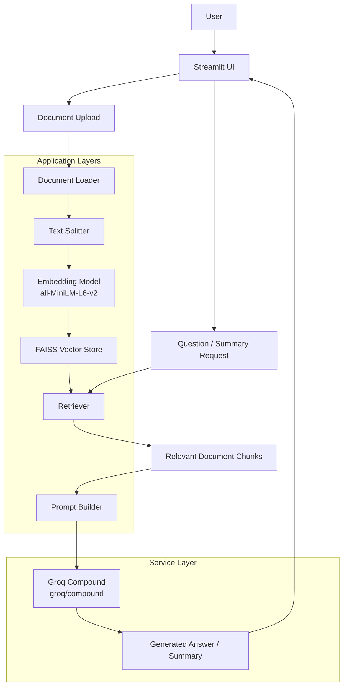

# Research Paper Assistant

An AI-powered research paper analysis application built with **Python, Streamlit, LangChain, FAISS, Hugging Face Sentence Transformers, and Groq**.

The application allows users to upload research papers, build a retrieval pipeline, ask questions grounded in the uploaded documents, and generate structured research-paper summaries.

---

## Architecture Diagram



---

## Demo Video

### `rec.mp4`

The repository includes a recorded demonstration of the application:

**[Watch / Open Demo Video — rec.gif](./rec.gif)**

> The demo shows the main application workflow, including document upload, pipeline construction, question answering, and research-paper summarization.

---

## Features

### Document Ingestion
- Upload research papers in PDF and DOCX format.
- Extract page-level document content.
- Preserve document metadata such as source and page information.

### RAG Pipeline
- Recursive text chunking with configurable chunk size and overlap.
- Semantic embeddings using:
  - `sentence-transformers/all-MiniLM-L6-v2`
- FAISS-based vector indexing.
- Similarity-based retrieval with configurable `top_k`.

### Question Answering
- Ask questions about uploaded research papers.
- Retrieve the most relevant document chunks.
- Generate grounded answers using **Groq `groq/compound`**.
- Return supporting document sources and page information.

### Research Paper Summarization
- Generate structured summaries from uploaded papers.
- Uses batch-based processing for longer documents.
- Uses hierarchical synthesis to combine intermediate summaries.
- Includes source/page references where available.

### Application Engineering
- Service-oriented application structure.
- Centralized configuration.
- Environment-variable based API key configuration.
- Logging for application, retrieval, and LLM operations.
- Automated tests across core modules and end-to-end workflows.

---

## Technology Stack

| Category | Technology |
|---|---|
| Language | Python |
| UI | Streamlit |
| LLM | Groq `groq/compound` |
| RAG Framework | LangChain |
| Embeddings | Hugging Face Sentence Transformers |
| Embedding Model | `all-MiniLM-L6-v2` |
| Vector Database | FAISS |
| Document Processing | PyPDF / DOCX loaders through LangChain |
| Testing | Pytest |
| Configuration | `.env` / `python-dotenv` |
| Logging | Python `logging` |
| Environment | Python virtual environment |

---

## How the RAG Pipeline Works

The application follows a standard retrieval-augmented generation workflow:

```text
Research Paper
      ↓
Document Loading
      ↓
Text Extraction
      ↓
Chunking
      ↓
Embedding Generation
      ↓
FAISS Index
      ↓
Similarity Retrieval
      ↓
Relevant Context
      ↓
Prompt Construction
      ↓
Groq Compound
      ↓
Grounded Answer
```

### Step-by-step

1. A user uploads one or more research papers.
2. The document loader extracts the content page by page.
3. The extracted text is split into overlapping chunks.
4. Each chunk is converted into a semantic embedding.
5. The embeddings are stored in a FAISS vector index.
6. A user question is converted into a retrieval query.
7. FAISS returns the most relevant chunks.
8. The retrieved context is passed to the LLM through a structured prompt.
9. Groq generates the final answer using the retrieved paper context.

This reduces the need to provide the entire paper to the model for every question and keeps answers grounded in the uploaded material.

---

## Project Structure

```text
research-paper-assistant/
│
├── app/
│   │
│   ├── config/
│   │   ├── prompts/
│   │   │   ├── qa_prompt.json
│   │   │   ├── summary_prompt.json
│   │   │   └── system_prompt.json
│   │   └── config.py
│   │
│   ├── ingestion/
│   │   ├── __init__.py
│   │   ├── document_loader.py
│   │   └── text_splitter.py
│   │
│   ├── rag/
│   │   ├── __init__.py
│   │   ├── embeddings.py
│   │   ├── retriever.py
│   │   └── vector_store.py
│   │
│   ├── services/
│   │   ├── __init__.py
│   │   ├── llm_service.py
│   │   ├── pipeline_service.py
│   │   ├── qa_service.py
│   │   └── summarizer.py
│   │
│   ├── utils/
│   │   ├── __init__.py
│   │   └── logger.py
│   │
│   ├── __init__.py
│   └── main.py
│
├── data/
│   ├── sample_papers/
│   └── test_vector_store/
│
├── logs/
│   ├── app.log
│   └── errors.log
│
├── tests/
│   ├── test_document_loader.py
│   ├── test_embedding_pipeline.py
│   ├── test_embeddings.py
│   ├── test_end_to_end.py
│   ├── test_ingestion_pipeline.py
│   ├── test_llm_service.py
│   ├── test_logger.py
│   ├── test_pipeline_service.py
│   ├── test_qa_service.py
│   ├── test_retriever.py
│   ├── test_retriever_pipeline.py
│   ├── test_summarizer.py
│   ├── test_text_splitter.py
│   ├── test_vector_store.py
│   └── test_vector_store_pipeline.py
│
├── .env.example
├── .gitignore
├── pyproject.toml
├── README.md
├── rec.mp4
├── requirements.txt
└── roadmap.md
```

> `.env` and local virtual-environment files are intentionally excluded from version control.

---

## Installation

### 1. Clone the repository

```bash
git clone https://github.com/Ujjawal-Bisht/research-paper-assistant
cd research-paper-assistant
```

### 2. Create a virtual environment

```bash
python -m venv .venv
```

### 3. Activate the virtual environment

#### Windows PowerShell

```powershell
.venv\Scripts\Activate.ps1
```

#### Windows Command Prompt

```cmd
.venv\Scripts\activate
```

### 4. Install dependencies

```bash
pip install -r requirements.txt
```

---

## Environment Variables

Create a `.env` file in the project root.

```env
GROQ_API_KEY=your_groq_api_key
```

Do not commit the real `.env` file to GitHub.

Use `.env.example` as the template for required environment variables.

---

## Running the Application

From the project root:

```bash
streamlit run app/main.py
```

If your environment does not resolve the project package automatically, on Windows PowerShell you can use:

```powershell
$env:PYTHONPATH = "."
streamlit run app/main.py
```

---

## Basic Usage

### Step 1 — Upload Documents

Upload one or more:

```text
.pdf
.docx
```

files from the Streamlit sidebar.

### Step 2 — Configure Retrieval

The application supports configuration of:

- Chunk size
- Chunk overlap
- Top-k retrieved chunks

### Step 3 — Build the Pipeline

The application loads the documents, creates chunks, generates embeddings, builds the FAISS index, and initializes the retriever.

### Step 4 — Ask Questions

Ask questions about the uploaded paper such as:

```text
What problem does the paper address?

What methodology does the authors use?

What are the main contributions?

What limitations are identified?

What future work is suggested?
```

### Step 5 — Generate a Summary

The summarization workflow processes longer papers in batches and then combines the intermediate results into a final structured summary.

---

## Configuration

Important configuration values are centralized in:

```text
app/config/config.py
```

Current application configuration includes:

```text
LLM model:
groq/compound

Embedding model:
sentence-transformers/all-MiniLM-L6-v2

Default chunk size:
500

Default chunk overlap:
100

Default top-k:
5
```

These values can be adjusted for experimentation and retrieval evaluation.

---

## Testing

The project contains unit, integration, and end-to-end tests.

Run the complete suite with:

```bash
pytest
```

For verbose output:

```bash
pytest -s
```

The test suite covers areas including:

- document loading
- text splitting
- embeddings
- vector store creation
- vector store persistence
- retrieval
- LLM service behavior
- question answering
- summarization
- pipeline orchestration
- end-to-end workflows

The live Groq integration test can be controlled separately so that regular test runs do not unnecessarily consume API quota.

---

## Evaluation Plan

A key objective of this project is to evaluate how RAG configuration affects retrieval quality and LLM performance.

### Retrieval Evaluation

Compare different:

```text
Chunk sizes
Chunk overlaps
Top-k values
```

Example experiment:

| Parameter | Values |
|---|---|
| Chunk size | 300, 500, 800, 1000 |
| Chunk overlap | 50, 100, 150 |
| Top-k | 3, 5, 8, 10 |

Potential metrics:

- Precision@K
- Recall@K
- Hit Rate
- Retrieval latency

### Embedding Model Evaluation

Compare multiple embedding models and record:

- Retrieval quality
- Embedding dimensionality
- Inference latency
- Memory usage

### Answer Evaluation

Evaluate generated answers for:

- Faithfulness to retrieved evidence
- Correctness
- Relevance
- Citation/source coverage

The objective is to identify configurations that provide a strong balance between retrieval accuracy, response quality, latency, and resource usage.

---

## Design Decisions

### Why RAG?

Research papers can contain more information than should be sent to an LLM in every request. RAG retrieves only the most relevant context before generation, improving grounding and reducing unnecessary context.

### Why FAISS?

FAISS provides efficient vector similarity search and is lightweight enough for a local development project.

### Why `all-MiniLM-L6-v2`?

It is a compact sentence-transformer model suitable for semantic text embeddings and local CPU-based experimentation.

### Why configurable chunking?

Chunk size and overlap directly influence the amount of context available to retrieval. Making them configurable allows retrieval experiments rather than hard-coding a single configuration.

### Why Groq?

Groq provides a fast inference API and supports the required `groq/compound` model used by this project.

---

## Logging

Application logs are stored under:

```text
logs/
├── app.log
└── errors.log
```

The logging system records:

- pipeline execution
- document loading
- chunk creation
- embedding initialization
- vector-store operations
- retrieval
- LLM requests
- summarization stages
- errors and exceptions

Sensitive credentials such as API keys should never be written to logs.

---

## Error Handling

The application is designed to handle common failure scenarios including:

- missing API configuration
- invalid document input
- empty documents
- invalid retrieval parameters
- vector-store failures
- LLM/API failures
- API rate limits

Large-document summarization is implemented using batch processing and hierarchical synthesis to avoid excessively large LLM prompts.

---

## Limitations

Current limitations include:

- LLM functionality depends on external Groq API availability and quota.
- Summarization can require multiple LLM requests for longer papers.
- The current vector store is optimized for local development rather than multi-user production workloads.
- Evaluation metrics are still an area for continued experimentation.
- Web search, URL retrieval, and additional research-agent tools are planned extensions rather than core functionality of the current stable implementation.

---

## Future Improvements

Planned improvements include:

### Agent and Tool Layer
Extend `app/agents/` with tools such as:

- PDF search
- URL fetching
- Web search
- Tool selection / agent orchestration

### Retrieval Improvements
- Hybrid retrieval
- Metadata-aware filtering
- Reranking
- Better citation tracking

### Evaluation
- Automated retrieval benchmarking
- Faithfulness scoring
- Embedding model comparison
- Chunking and top-k experiments
- Latency and token-cost analysis

### Performance
- Cache embedding models
- Reduce unnecessary LLM requests
- Optimize summary generation
- Improve Streamlit resource reuse

### Production Readiness
- Persistent production vector database
- Authentication
- Multi-user support
- Cloud deployment
- Monitoring and observability

---

## Learning Outcomes

This project demonstrates practical experience with:

- Retrieval-Augmented Generation (RAG)
- LangChain
- Vector databases and similarity search
- Semantic embeddings
- FAISS
- Prompt engineering
- LLM API integration
- Document processing
- Python application architecture
- Automated testing
- Logging and error handling
- Streamlit application development

---

## Repository Structure Philosophy

The project is organized into separate layers:

```text
ingestion
   ↓
rag
   ↓
services
   ↓
application UI
```

This separation keeps document processing, retrieval, LLM interactions, business logic, and user-interface code independently testable and easier to extend.

---

## License

Add your preferred license here.

For example:

```text
MIT License
```

---

## Author

**Ujjawal Bisht**

Built as a practical RAG/LLM project for learning, experimentation, and portfolio development.
